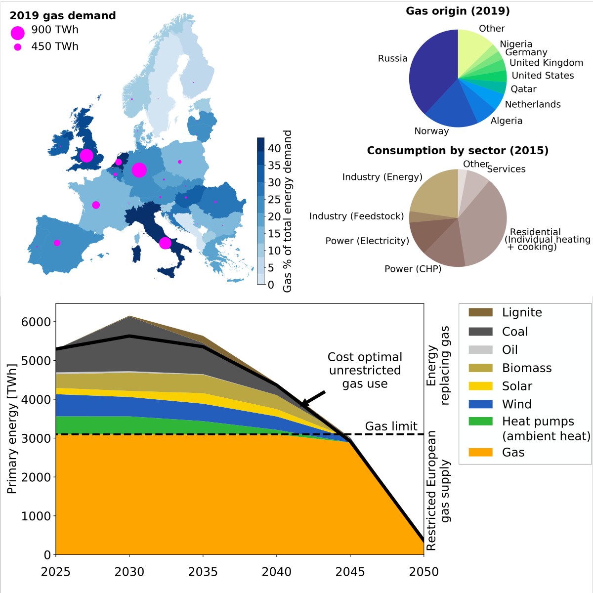

# Long-term implications of reduced gas imports on the decarbonization of the European energy system

This repository contains all scripts used in the making of the manuscript titled *"Long-term implications of reduced gas imports on the decarbonization of the European energy system"*. All results found in the *results/* folder are made with the [PyPSA-Eur-Sec v0.5.0](https://github.com/PyPSA/pypsa-eur-sec/tree/v0.5.0) model. A detailed description of the model is provided in the paper [Speed of technological transformations required in Europe to achieve different climate goals](https://arxiv.org/abs/2109.09563). Model documentation is found at [readthedocs](https://pypsa-eur-sec.readthedocs.io/en/latest/).

Only parts of the results data have been included in this repository due to size limitations. For the raw results data see the [Zeonodo repository with DOI 10.5281/zenodo.6376540](https://doi.org/10.5281/zenodo.6376540).

The code is released as free software under the
[GPLv3](http://www.gnu.org/licenses/gpl-3.0.en.html) license.

